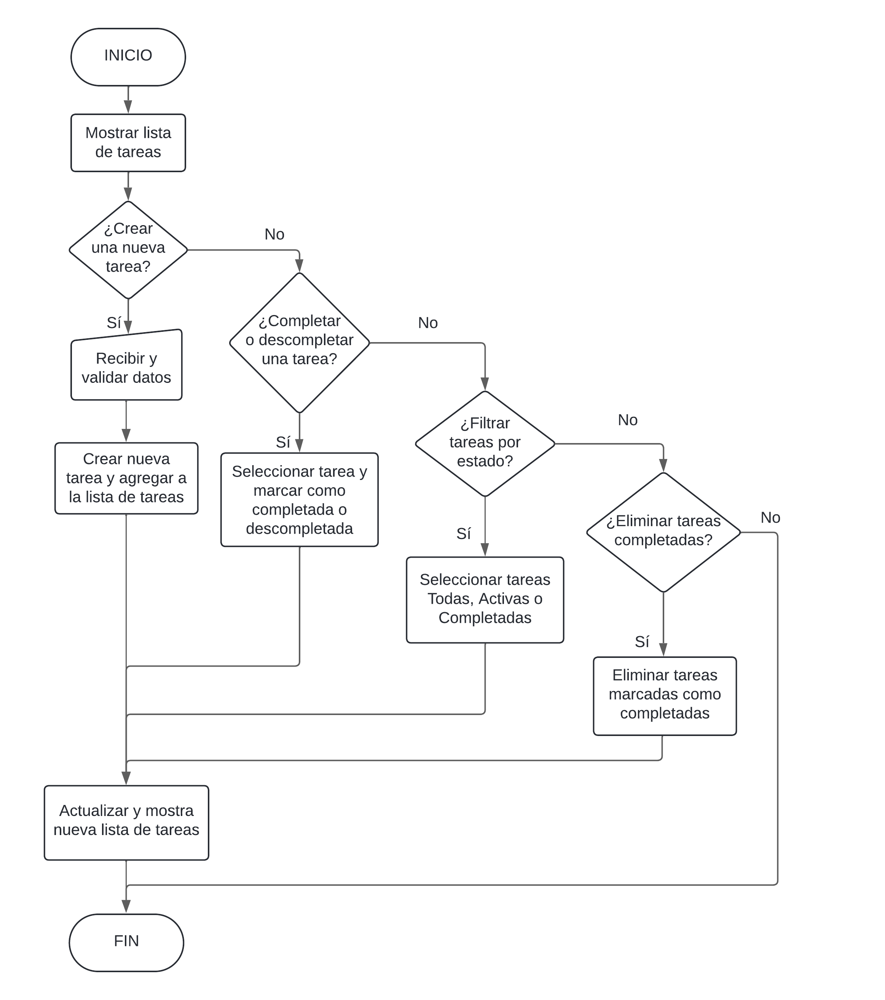
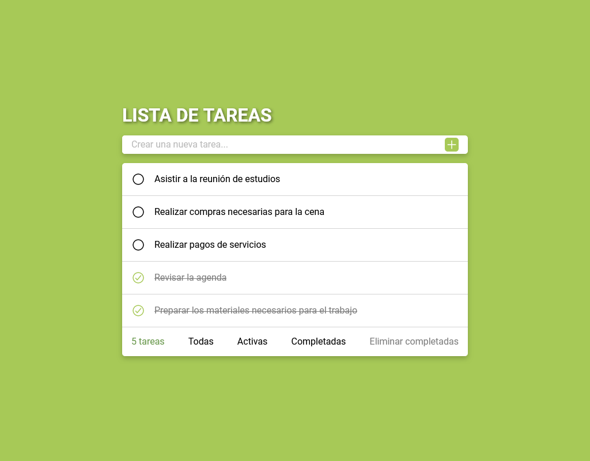

# Lista de tareas sencilla para Curso de JavaScript Desde Cero - Platiz

Lista de tareas sencillas es un proyecto que busca implementar la mayor cantidad de conceptos o temas vistos en el Curso de JavaScript Desde Cero - Platzi.

## Tabla de contenido

- [Resumen](#resumen)
  - [El proyecto](#el-proyecto)
  - [Screenshot](#screenshot)
  - [Links](#links)
- [Desarrollo](#desarrollo)
  - [Construido con](#construido-con)
  - [Lo que aprendí](#lo-que-aprendí)
- [Autor](#autor)
- [Agradecimientos](#agradecimientos)

## Resumen

### El proyecto

Es una aplicación web de gestión de tareas (un simple ToDo list) en la que un usuario puede:

- Agregar nuevas tareas
- Marcar tareas como completadas
- Eliminar las tareas completadas
- Filtrar tareas por estados (todas/activas/completadas)
- Ver un contador de tareas por filtro (todas/activas/completadas)

Para poder desarrollar el proyecto se creó y utilizo el siguiente diagrama de flujo:

### Screenshot

### Links

- Solution URL: <https://github.com/codepalacios/lista-de-tareas-sencilla-cjdc>
- Live Site URL: <https://codepalacios.github.io/lista-de-tareas-sencilla-cjdc/>

## Desarrollo

### Construido con

- Marcado semántico HTML5
- Propiedades personalizadas de CSS
- CSS Grid
- Flexbox
- Mobile-first workflow

### Lo que aprendí

- Manipulación de strings
- Uso de clases y objetos
- Manejo de arrays
- Creación de funciones

## Autor

- GitHub - [@codepalacios](https://github.com/codepalacios)
- Frontend Mentor - [@codepalacios](https://www.frontendmentor.io/profile/codepalacios)

## Agradecimientos

Quiero agradecer a los profesores del curso por compartir sus conocimientos con la comunidad de Platzi:

- 👧 Estefany Aguilar 👏
- 👦 Diego De Granda 👏
